<div align="center">



</div>
<br></br>
<br/>

<div align="center">

[](https://github.com/mounika-rao)

</div>

<br/>

## 🛡️ `whoami`

```yaml
name: Mounika Rao
status: Seeking opportunities as SOC Analyst / Cloud Security Analyst
education: B.E. CSE (IoT, Cybersecurity & Blockchain Technology) @ M.V.S.R. Engineering College (2023-2027)
focus: [Cloud Security, Secure IoT Architectures, AI Threat Detection, Network Protection]
mindset: secure-by-design 🔒
```

- 💡 Building hands-on experience in **threat detection, log analysis, and cloud security**.
- 🧠 Approaches every system with a **secure-by-design, zero-trust mindset**.
- ⚡ Currently exploring **AI-powered threat detection** and network defense.

<br/>

## 🧰 `arsenal --list`

<div align="center">

**Languages & Databases**


**Security & Cloud**


**SIEM & Monitoring**


**Tools & Platforms**


</div>

<br/>


<br/>

## 🔗 `connect --with-me`

<div align="center">

[](https://www.linkedin.com/in/veeramaneni-mounika-aa957a316/)

</div>
